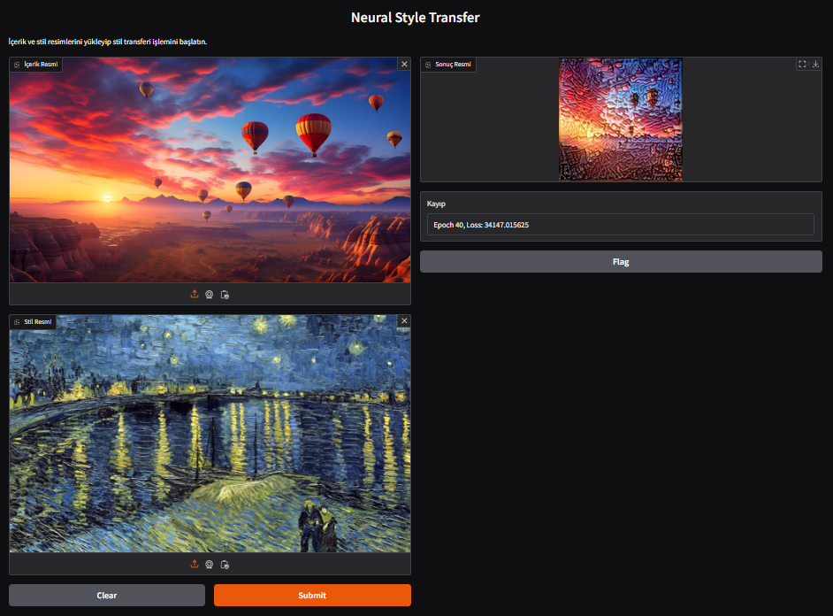

# Neural Style Transfer with Gradio

A neural style transfer application that blends the content of one image with the artistic style of another, powered by VGG19 and served through an interactive Gradio web interface.

## How It Works

1. **Feature Extraction** — VGG19 (pretrained on ImageNet) extracts features from content and style images
2. **Style Layers** — `block1_conv1`, `block2_conv1`, `block3_conv1`, `block4_conv1` capture artistic style
3. **Content Layer** — `block5_conv2` preserves the structural content
4. **Gram Matrix** — Computes style correlations between feature maps
5. **Optimization** — Adam optimizer (lr=0.02) minimizes total loss over 200 epochs
6. **Gradio UI** — Upload content + style images, get the stylized result instantly

## Loss Function

```
Total Loss = (style_weight × Style Loss) + (content_weight × Content Loss)

style_weight = 1e-2
content_weight = 1e4
```

- **Style Loss** — Mean squared difference between Gram matrices of generated and style images
- **Content Loss** — Mean squared difference between content features of generated and content images

## Results



## Tech Stack

- **Model**: VGG19 (pretrained on ImageNet, include_top=False)
- **Framework**: TensorFlow / Keras
- **Optimization**: Adam (lr=0.02, 200 epochs)
- **UI**: Gradio
- **Image Processing**: PIL, NumPy

## Usage

```bash
pip install gradio tensorflow pillow numpy

# Run the notebook or:
python -c "exec(open('Neutral_Style_Transfer.ipynb').read())"
```

Upload a content image and a style image in the Gradio interface, and the stylized output is generated automatically.

## Notebook

| File | Description |
|------|-------------|
| `Neutral_Style_Transfer.ipynb` | Full pipeline: VGG19 feature extraction, style transfer optimization, Gradio web UI |
